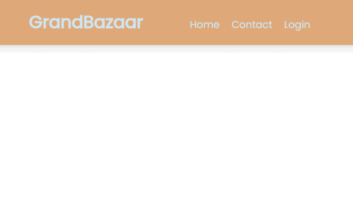
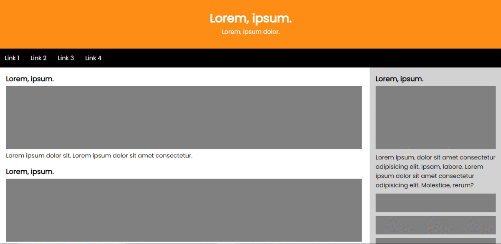

# Front End Fundamentals Projects

I'll show you my first front end projects in this repository. 
This way you can see my progress from the first project to the last project.

### Projects

* Responsive Navbar

This project is my first html, css, and javascript project. I tried make responsive navbar with toggle bar for navbar links. I used a little javascript for toggle bar, and I researched how can I use it before start project.

* Flex Image Gallery

Simple image gallery project.

* Flex-layout

It's a very easy layout project, but I think it is important for beginners as a first step.

